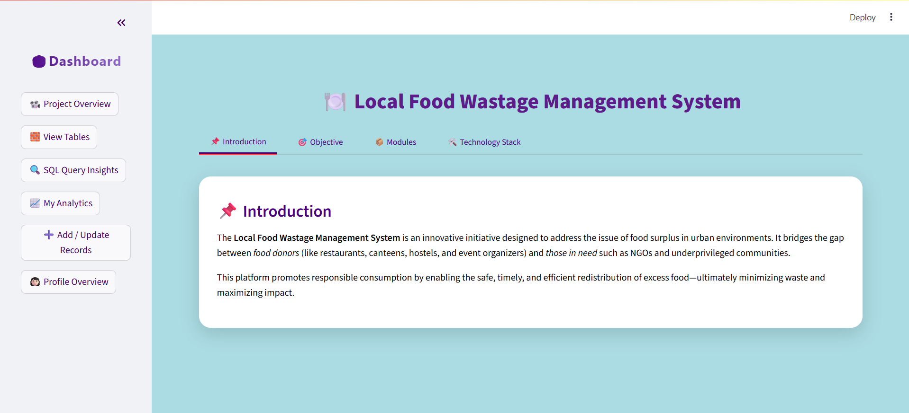
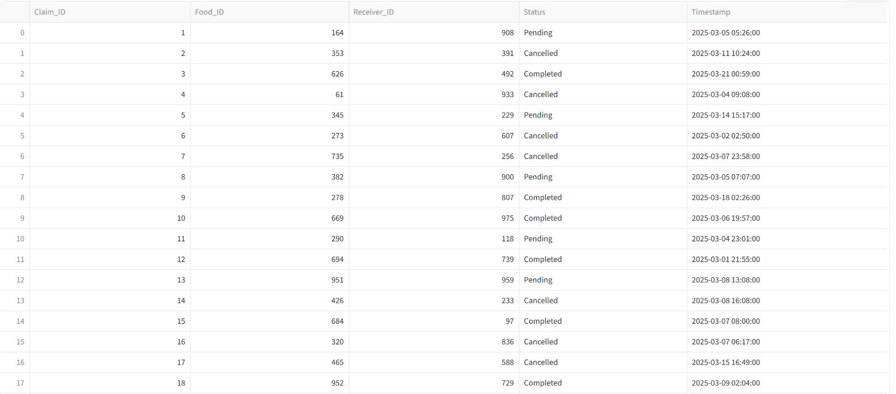
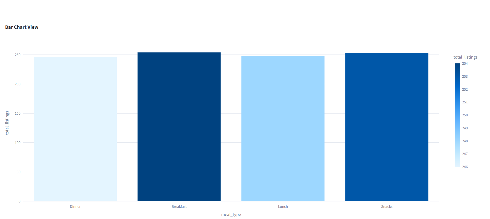

# 🥗 Local Food Wastage Management System

> A real-time, SQL-powered web application for managing surplus food donations using Python, Streamlit, and PostgreSQL.

## 🚀 Project Overview

This project aims to reduce food waste by connecting food *Providers* (restaurants, supermarkets, etc.) with *Receivers* (NGOs, shelters, individuals in need). It uses data-driven insights to improve donation visibility, optimize claims, and promote sustainability.

### 🌱 Key Goals
- Minimize food wastage through digital donation tracking.
- Support hunger relief efforts by streamlining food claims.
- Enable transparency using interactive dashboards & SQL analysis.

---

## 📊 Features

- 🔍 *Live Table Viewer*: View and filter records from Providers, Receivers, Listings, and Claims.
- 📈 *Data Insights*: Answer 15+ SQL-powered real-world questions with visualizations (bar, pie, donut, etc.).
- 🧠 *EDA & Analytics*: Understand trends in food type, claims status, meal preferences.
- ➕ *CRUD Operations*: Add or update food listings and claims via user-friendly forms.
- 📍 *Location Filtering*: Filter donations based on city, provider type, and meal categories.
- 📞 *Direct Contact*: View contact info for all registered providers and receivers.
- 🖼 *Beautiful UI*: Styled with custom CSS and animated cards for a polished user experience.

---

## 📂 Technologies Used

| Tech        | Purpose                                |
|-------------|----------------------------------------|
| Python    | Backend scripting and logic            |
| Streamlit | Frontend app and interactivity         |
| PostgreSQL| Database for storing all food records  |
| Pandas    | Data manipulation and cleaning         |
| Plotly    | Visualization & analytics    |
| dotenv    | Secure handling of DB credentials      |

---

## 🗂 Database Schema

- *Providers*: Provider_ID, Name, Type, Address, City, Contact
- *Receivers*: Receiver_ID, Name, Type, City, Contact
- *Food_Listings*: Food_ID, Food_Name, Quantity, Expiry_Date, Provider_ID, etc.
- *Claims*: Claim_ID, Food_ID, Receiver_ID, Status, Timestamp

---

## ❓ SQL-Based Analytical Questions Answered

1. Count of providers and receivers in each city  
2. Top contributing provider types  
3. Contact details of providers by city  
4. Top receivers based on claim count  
5. Total quantity of food available  
6. Cities with highest food listings  
7. Most common food types donated  
8. Claim count per food item  
9. Providers with highest successful claims  
10. Claims breakdown: Completed vs Pending vs Cancelled  
11. Avg. quantity claimed per receiver  
12. Most claimed meal type  
13. Total quantity donated per provider  
14. Trends in claim timing and expiration  
15. City-wise demand vs supply analysis

---

## 📷 Screenshots

| Home Page | Filtered Tables | Visual Insights |
|-----------|------------------|------------------|
|  |  |  |

---

## ⚙ Setup Instructions

1. *Clone the repo*
   bash
   git clone https://github.com/your-username/food-waste-management.git
   cd food-waste-management
   

2. *Install dependencies*
   bash
   pip install -r requirements.txt
   

3. *Set environment variables*  
   Create a .env file in the Database sub-directory and add the following:

   ini
   DB_HOST=your_host
   DB_PORT=5432
   DB_DATABASE=your_db
   DB_USER=your_username
   DB_PASSWORD=your_password
   

4. *Run the Streamlit app*
   bash
   streamlit run app.py
   

---

## 🙋‍♀ About Me

I am currently pursuing my *Master’s in Computer Applications (MCA)* and learning *Data Science* through real-world projects and continuous hands-on practice.  
I'm passionate about solving social problems using *data, **machine learning, and **user-friendly tech platforms*.

- 🔗 [Connect with me on LinkedIn](https://www.linkedin.com/in/yamini-s-886572371/)

---

## 📄 License

This project is licensed under the *MIT License*.  
Feel free to use, modify, and share with attribution.

---

## ⭐ Show Your Support

If you found this project useful, please consider *giving it a ⭐ on GitHub*!  
Every star encourages me to build more impactful open-source tools like this.
